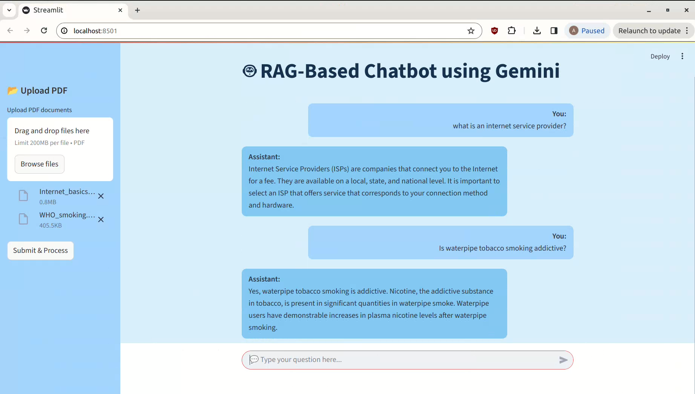
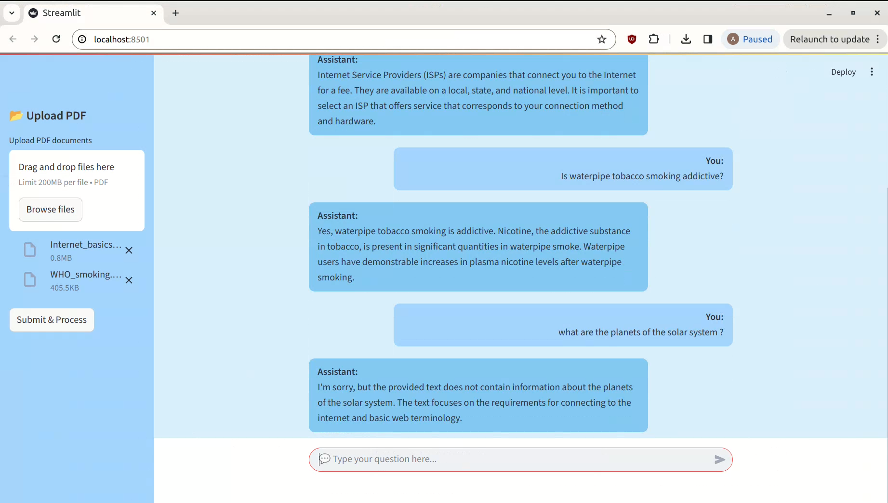

# 🤖 RAG-Based Chatbot using Gemini (Google Generative AI)

[](https://opensource.org/licenses/MIT)


---

## 🧠 Overview

This project implements a **Retrieval-Augmented Generation (RAG)** chatbot powered by **Google Gemini (Generative AI)**. It enables users to upload PDF documents and interact with a chatbot that provides highly relevant, context-aware answers based on those documents. It combines document parsing, vector search (via ChromaDB), and generative capabilities into one seamless user experience using Streamlit.

---

## 🚀 Key Features

- 📄 **PDF Upload Support**: Upload one or more PDF files to build a knowledge base.
- 🧠 **Vector-Based Document Retrieval**: Uses ChromaDB to perform semantic similarity search using embeddings.
- 🤖 **Gemini-Powered LLM**: Uses **Google Gemini Flash** for fast and accurate natural language responses.
- 🗂️ **Memory Handling**: Maintains session-level chat history.
- 🖥️ **Streamlit UI**: Clean and responsive chat interface with file uploader.

---

## 🧰 Technologies Used

| Tool                         | Purpose                                                  |
|------------------------------|----------------------------------------------------------|
| **Python 3.10+**             | Programming language                                     |
| **Streamlit**                | Web framework for UI                                    |
| **LangChain**                | RAG chain, document loading, and prompt templating      |
| **Chroma**                   | Local vector database to store and query embeddings     |
| **Google Generative AI**     | Gemini API for embeddings and LLM responses             |
| **PyPDFLoader**              | For parsing and loading PDF files                       |

---

## ⚙️ Setup and Installation

### 1. Clone the Repository

```bash
git clone https://github.com/Abhinav-Marlingaplar/RAG-Chatbot.git
cd rag-chatbot-gemini

### 2. Install Dependencies
It’s recommended to use a virtual environment.

```bash
pip install -r requirements.txt
```

### 3. Add Your Gemini API Key
Create a .env file and add your API key:

```bash
GOOGLE_API_KEY=your_gemini_api_key
```

### 4. Run the Streamlit App

```bash
streamlit run app.py
```

## Sample Images of the RAG Chatbot
<div style="display: flex; justify-content: center;">
    
    
</div>

## License

This project is licensed under the MIT License. See the `LICENSE` file for more details.

## Author

Abhinav Marlingaplar
